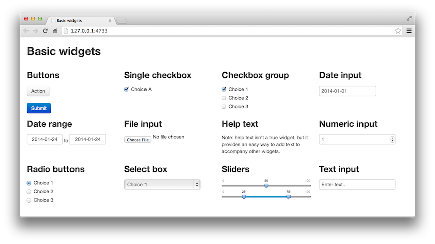

## What Is `shiny`?

`shiny` is [a web application framework for R](shiny.rstudio.com)

You can create a web application where you define the user interface (UI) look and feel and create R code to work behind the scenes to generate output

There are two main software components to `shiny`:

 * the `shiny` [R package](https://cran.r-project.org/package=shiny) that is installed into R
 * a `shiny` server that runs the web application.
 
To develop and test applications, only the R package is required.  

---

# Illustrations

John Chambers invented the S language "to turn ideas into software, quickly and faithfully".

`shiny` attempts to do the same thing with R and visualization. 

Here are some instances that meld statistics and visualizations:

 * [Visual Algorithms for the Traveling Salesman Problem](https://gallery.shinyapps.io/shiny-salesman/)
 * [Airline Performance Comparison](http://nycdatascience.com/airline-performance-comparison-with-rshiny/)
 * [Playing with Google Analytics Data](https://mcpasin.shinyapps.io/PlayingGoogleAnalyticsDataViz)
 * [Visualize and Explore an Entire Genome](https://gallery.shinyapps.io/genome_browser/)
 * [Inter-Individual Variability in Pharmacokinetics](http://shiny.webpopix.org/stat/pkiiv1/)
 * [Crime Data Visualisation](https://blenditbayes.shinyapps.io/crimemap/)
 * [Process Mass Intensity (PMI) for Chemical Synthesis route](https://acsgcipr-predictpmi.shinyapps.io/pmi_calculator/)

---

# Advantages 

 * `shiny` is free ("as in beer" and "as is speech"")`*`
 * you can install it anywhere without worrying about licenses
 * it is well-supported (officially and unofficially) and well-developed
 * it integrates with modern web features (e.g. HTML, Javascript, Google Widgets, css, JSON, markdown, etc)
 * reliable
 * cross-platform
 * it knows how to handle types of R objects (e.g. plots vs tables vs text etc.)
 * great integration with RStudio 
 * rich user-interface capabilities 
 * dozens of `shiny` related packages on CRAN and Bioconductor, thousands of [related github repositories](http://bit.ly/1PyOUwg)
 
`*` _Some_ deployment options (RStudio Connect, ShinyApps.io) ar enot free

---

# Disadvantages

 * need to know `R`
 * requires a web server to let other people use the applications
 * typically does not enable _large_ scale interactive data analysis 
 * was not created for a "launch the job and come back" approach (although you can do this)

---

# Resources to Learn More

 * [Teach yourself `shiny`](http://shiny.rstudio.com/tutorial/)
 * the [`shiny` cheatsheet](http://shiny.rstudio.com/articles/cheatsheet.html)
 * [Gallery/examples](http://shiny.rstudio.com/gallery/)
 * Stackoverflow [`shiny` questions](http://stackoverflow.com/questions/tagged/?tagnames=shiny&sort=newest)
 * [`shiny` on CRAN](https://cran.r-project.org/package=shiny)
 * `shiny` articles on [R-Bloggers](https://cse.google.com/cse?cx=005359090438081006639%3Apaz69t-s8ua&ie=UTF-8&q=shiny&sa=Go)
 * [github repository](https://github.com/rstudio/shiny)
 * [other shiny github projects](http://bit.ly/1PyOUwg)

---

# Today 

Our goal for this workshop is:

 * focus on `shiny` applications (not the server)
 * get everyone comfortable with server and user interface code
 * show examples of inputs and outputs
 * demonstrate reactivity
 * illustrate how to test and develop your application


---

# Basic Structure of an Application

A shiny application is usually contained in a specific directory. 

The typical structure of an application directory is to have at least one file (`app.R`). 

 * Older applications sometimes use two files (`server.R` and `ui.R`)

A shiny application usually has a UI (user-interface) component and a server component.  

The directory can have other files, such as `RData` files with results or data. 
 
---

# Application 1: Show a plot in the browser

We have a set of example applications in the workshop materials:

<pre>
├── simple_app
│   └── app.R
├── sidebar_app
│   └── app.R
└── roundtrip
    ├── app.R
    └── safety_data.csv
</pre>

Our first application is `simple_app`.

---

# The UI Part

The UI component contains an R object that has information on the  _page type_ and any _control objects_. 

An example would be created using the `fluidPage()` function but others exist (e.g. `navbarPage()`). For example:


```{r ui_pseudo, eval=FALSE}
ui_part <- 
  fluidPage(
    ## panels, tabs, text, outputs (e.g. plots, tables etc) go here
  )
```

Here is a simple UI compnent for `simple_app` that just shows a plot:

```{r ui_simple, eval=FALSE}
library(shiny)

ui_part <- 
  fluidPage(
    plotOutput("that_plot") # grab an output element with this name
  )
```


---

# The Server Part

The server object is an R function that has two arguments:

 * `input` will have any variables or data passed in from the user via the UI (examples will be seen later)
 
 * any objects that we want to pass back to the UI will be contained in `output` using special functions for the type of output. 
 
 * another argument, `session`, can be used but won't be discussed here
 
```{r server_example, eval=FALSE}
server_part <- 
  function(input, output) {
    ## some R code
  }
)
```

---

# The Server Outputs

The `shiny` package (and others) contains functions that encapsulate different types of objects/outputs that you want to throw back to the UI. 
 
For example, we will want to send an image back with in an output element called `"that_plot"` so we will use the `renderPlot` function. 

Other functions:

```{r renderers}
library(shiny)
apropos("^render")
```


---

# Our `app.R` File

```{r server_simple, eval=FALSE}
library(shiny)
library(ggplot2)

ui_part <- 
  fluidPage(
    plotOutput("that_plot") # grab an output element with this name
  )

server_part <- function(input, output) {
  ## The output name ("that_plot") matches the inuput above
  output$that_plot <- renderPlot(
    ggplot(mpg, aes(x = displ, y = cty)) +  geom_point() + theme_bw() 
  )
}

shinyApp(ui = ui_part, server = server_part)
```

 
To test it in R on your computer, point the `runApp` function towards the place where you saved the shiny application:

```{r run_simple, eval=FALSE}
library(shiny)
runApp("c:\\path\\to\\simple_app")
```


---

# Application 2: A Little More Complicated...

Let's add some UI elements. For example, we can add a [loess fit](https://en.wikipedia.org/wiki/Local_regression) to the plot and let the user control the smoothness of the function.

To do this, we need to:

 1. make space for a UI element
 2. add a controller to let the user choose the smoothness
 3. pass that value to the `ggplot` code
 4. update the plot when the user changes the input

The example code is in the `sidebar_app` directory. 

---

# Step 1: Make Space for a UI Element

First, let's arrange the application so that the user's input is on the left-hand side and the plot is to the right. 

An easy way to do this is to use a _sidebar_. Our UI file will change to reflect what goes into the sidebar (i.e. the input device) and the main panel (the plot). 


---

# Step 1: Make Space for a UI Element

```{r layout_slider, eval=FALSE}
ui <- 
  fluidPage(
    sidebarLayout(
      sidebarPanel(
        ## add UI elements here
        ## adding more stacks them in rows
      ),
      mainPanel(
        ## Add our plot output here
        ## Additional outputs also stack
      )
    )
  )
```


---

# Basic UI Elements

```{r widgets, out.width="80%", echo = FALSE}

```

See the [Shiny Widgets Gallery](http://shiny.rstudio.com/gallery/widget-gallery.html) to interactively play with the code that defines these. 


---

# Step 2: Add a Controller

Let's use a slider to control how smooth the line is via the `span` argument of the `loess` function:

```{r ui_slider, eval=FALSE}
ui <- 
  fluidPage(
    sidebarLayout(
      sidebarPanel(
        sliderInput(inputId = "span", label = "Smoother Span:",  
                    min = .2, max = 1, value = .8)
      ), # sidebarPanel
      mainPanel(plotOutput("that_plot"))
    ) # sidebarLayout
  ) # fluidPage
```

We could add multiple items to the sidebar and main panels.

---

# Step 3: Pass the Value to the `ggplot` Code

In the UI component, our `sliderInput` code had `inputId = "span"`. 

In the server file, the `input` list will have an element called `"span"`. 

```{r server_slider, eval=FALSE}
server <- 
  function(input, output) {
    output$that_plot <- renderPlot(
      ggplot(mpg, aes(x = displ, y = cty)) + 
        geom_point() + theme_bw() +
        geom_smooth(method = "loess", span = input$span)
    ) # that_plot
  } # function
```


---

#  Step 4: Update the Plot 

Magic!

`shiny` has a feature called _reactivity_ where the server code is called whenever a UI element is changed and it requires the code to be re-run. It is automatic but lazy.

Notes/pro-tips:

 * There are ways to defer the updating. You could add an action button (i.e. "Compute!") that will control when the calculations start
 
 * UI elements can be reactive. You can have the server component determine what should be in the UI and send those elements back as output. 
 
 In the second case, you may want the UI to show the column names in your data set after the data have been read into R (this is the next example). 


---

#  Application 3: Uploading and Using Data 

Let's create another application that:

 * allows the user to upload a CSV file
 * choose a column to analyze
 * plot and summarize the data

This process will illustrate some new aspects of the system.

The example code is in the `roundtrip` directory. 

You can test it with any CSV file with data but the application directory has an example file called `safety_data.csv`. 


---

#  Uploading Files 

`shiny` has a UI capability that lets the user choose a local file and upload it to a temporary location called `fileInput`.

The UI component will have an _input handeler_:

```{r fileInput, eval=FALSE}
fileInput(inputId = 'csv_file', 
          label = 'Choose CSV File',
          accept = c('text/csv', 
                     'text/comma-separated-values,text/plain', 
                     '.csv'))
```

In R, the resulting `input$csv_file` can look something like this:

<pre>
'data.frame':	1 obs. of  4 variables:
 $ name    : chr "iris.csv"
 $ size    : int 2316
 $ type    : chr "text/csv"
 $ datapath: chr "/var/folders/ps/v0w2_8_x7kzcgfwmvl4n/T/f2a24e46c/0"
 </pre>

---

#  Catching the File in the Server 

We can write a explicitly _reactive_ function that ensures updating when the UI is changed:

```{r server_fileInput, eval=FALSE}
server <- 
  function(input, output) {  
    get_data <- reactive({
      ## Before the user chooses a file, we make sure that nothing is produced...
      req(input$csv_file)
      read.csv(input$csv_file$datapath)
    }) 
  }
```

We use the `reactive` function because we will not generate an object for the `output` list (not yet at least). 

`req()` is a cool function that doesn't do anything if the user [hasn't supplied input](http://shiny.rstudio.com/articles/req.html).

---

#  Getting the Column Names 

We want to be able to choose a column from our data and feed it back into the UI file so that the user can choose.  

We return the column names that are numeric. There may not be any, which results in a vector of length zero. 

```{r server_col_names, eval=FALSE}
get_col_names <- reactive({
  dat <- get_data()
  num_cols <- vapply(dat, is.numeric, logical(1))
  names(num_cols)[num_cols]
}) 
```


---

#  So far...

 Step 1: UI passes the file information to server  
 
 Step 2: server reads the data and finds the column names
 
 Step 3: server passes the numeric column names back to the UI using:

```{r server_value_choice, eval=FALSE}
output$column_choice <- renderUI({
  columns <- get_col_names()
    selectInput(inputId = "value_col", label = "Analysis Column", 
                choices = unique(c("None Selected" = "", columns)))
})
```

 Step 4: UI shows the results to the user via

```{r server_value_choice_ui, eval=FALSE}
uiOutput("column_choice")
```

Now let's look at how we create and display text and plots... 


---

#  Text Output
 
As an example of writing some text out to the user interface, this function is contained inside of the `shinyApp` call within the server:

```{r server_description, eval=FALSE}
output$description <- renderText({
  req(input$value_col)
  dat <- get_data()
  dat <- dat[[ input$value_col]]
  num_missing <- sum(is.na(dat))
  paste0("For these data, there were ", sum(!is.na(dat)),
         " data points and ", ifelse(num_missing == 0, " no ", num_missing),
         " missing values.")
}) 
```


---

#  Plot Output
 
In the UI, another controller was added to show a discrete choice:

```{r ui_radio, eval=FALSE}
checkboxInput(inputId = "log_scale", label = "Log Scale?", TRUE)
```

and the server contains:

```{r server_hist, eval=FALSE}
renderPlot({
  dat <- get_data()
  out <- ggplot(dat, aes_string(x = input$value_col)) +
    geom_histogram(alpha = .7, fill = "red", col = "red") + 
    theme_bw()
  if (input$log_scale) {
    out <- out + scale_x_log10()
  }
  out
}) 
```

---

#  Output in the UI file
 
In order to show these results to the user, the main panel contains two outputs:

```{r server_main_panel, eval=FALSE}
mainPanel(
  textOutput("description"),
  tags$br(),
  plotOutput("histogram")
) 
```

The line `tags$br()` adds a little space between the two outputs. 

---

# Session Info

.font60[

```{r}
sessionInfo()
```

]

